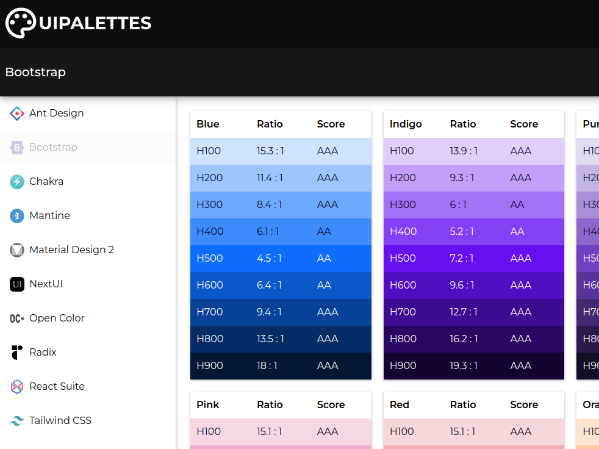

# uipalettes



uipalettes is a Progressive Web App (PWA) that provides web developers access to a curated library of high-quality color palettes that fully comply with the Web Content Accessibility Guidelines (WCAG).


<br/>

## Live Demo

[uipalettes](https://uipalettes.web.app/)


<br/>

## Getting Started

### Requirements

- GIT
- NodeJS ^v22.2.0
- NPM ^v10.7.0

### Installation

Clone the repository
```bash
$ git clone git@github.com:jesusgraterol/uipalettes.git
```

Install the dependencies
```bash
$ npm install
```


<br/>

## Usage

Run the Development Vite Server

```bash
$ npm run dev
```

Open `http://localhost:5173/` (the port may vary) with your favorite browser.


<br/>

## Build Process

Run the Vite Production Build
```bash
$ npm run build
```


<br/>

## Deployment

When a commit is pushed to the `main` branch, **Github Workflows** automatically pushes the new
distribution to **Firebase Hosting**.


<br/>

## Built With

- HTML5
- CSS3
- TypeScript
- React


<br/>

## Running the Tests

```bash
# Unit Tests
$ npm run test:unit

# Integration Tests
$ npm run test:integration

# E2E Tests
$ npm run test:e2e
```


<br/>

## Branding

**Font:** [Montserrat](https://github.com/jesusgraterol/webfont-montserrat)

**Primary Color:** #0C0C0C

**Secondary Color:** #171717

**Success Color:** #1B5E20

**Error Color:** #B71C1C

**Warn Color:** #BF360C

**Info Color:** #0D47A1

**Text Color:** #0f172a

**Light Text Color:** #64748b


<br/>

## @TODO

- ...


<br/>

## License

[MIT](https://choosealicense.com/licenses/mit/)


<br/>

## Acknowledgments

- [Ant Design](https://ant.design/docs/spec/colors/)
- [Bootstrap](https://getbootstrap.com/docs/5.0/customize/color/)
- [Chakra](https://v2.chakra-ui.com/docs/styled-system/theme)
- [Mantine](https://mantine.dev/theming/colors/)
- [Material Design 2](https://m2.material.io/design/color/the-color-system.html#tools-for-picking-colors)
- [NextUI](https://nextui.org/docs/customization/colors)
- [Open Color](https://yeun.github.io/open-color/)
- [Radix](https://www.radix-ui.com/colors)
- [React Suite](https://rsuitejs.com/resources/palette/)
- [Tailwind CSS](https://tailwindcss.com/docs/customizing-colors)
- [Montserrat | Google Fonts](https://fonts.google.com/specimen/Montserrat)
- [Material Icons | Google Fonts](https://fonts.google.com/icons)