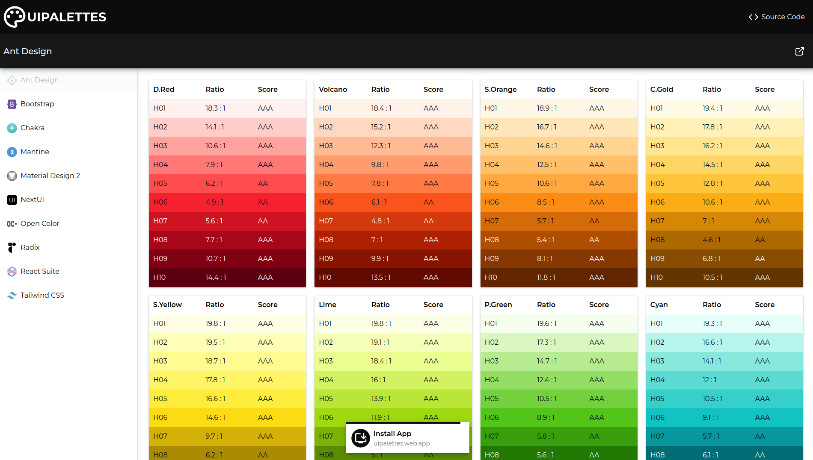

# UIPalettes



UIPalettes provides software developers quick access to high-quality color palettes provided by the most popular UI Design Frameworks compliant with the Web Content Accessibility Guidelines.

The key features are:

- ...
- Cross-Platform Compatibility


<br/>

## Live Demo

[UIPalettes](https://uipalettes.web.app/)


<br/>

## Getting Started

### Requirements

- GIT
- NodeJS ^v21.0.0
- NPM ^v10.2.0

### Installation

1) Clone the repository
```bash
git clone git@github.com:jesusgraterol/uipalettes.git
```

2) Install the dependencies
```bash
npm install
```


<br/>

## Usage

1) Run the Development Vite Server

```bash
npm run dev
```

2) Open `http://localhost:5173/` (the port may vary) with your favorite browser.


<br/>

## Build Process

Run the Vite Production Build
```bash
npm run build
```


<br/>

## Deployment

When a commit is pushed to the `main` branch, **Github Workflows** automatically pushes the new
distribution to **Firebase Hosting**.


<br/>

## Built With

- HTML5
- CSS3
- JavaScript
- React


<br/>

## Running the Tests

```bash
# Unit Tests
npm run test:unit

# Integration Tests
npm run test:integration

# E2E Tests
N/A
```


<br/>

## @TODO

- ...


<br/>

## License

[MIT](https://choosealicense.com/licenses/mit/)


<br/>

## Acknowledgments

- [Google Fonts](https://fonts.google.com/icons)
- [ESLint](https://eslint.org/)
- [Jest](https://jestjs.io/)
- [Babel](https://babeljs.io/)
- [Vite](https://vitejs.dev/)
- [React](https://react.dev/)
- [prop-types](https://github.com/facebook/prop-types)